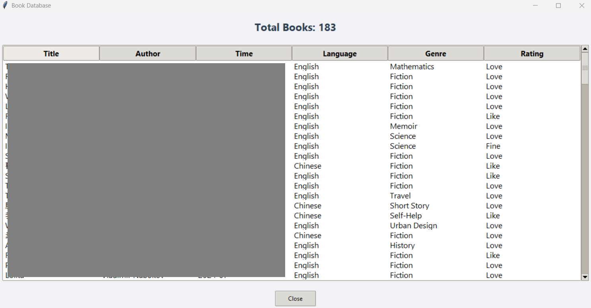

# MyCalibre

[English version below](#english-version)

## 繁體中文

個人閱讀與觀影紀錄應用程式，用於追蹤和分析我的書籍閱讀與影劇觀看歷史，並生成視覺化報告。

### 功能特色

**書籍追蹤**
- 記錄書籍的自訂資料（語言、譯者、類型、評分）
- 搜尋和篩選書籍收藏
- 生成包含閱讀分析的 PDF 報告（語言分布、每月趨勢等）
- 匯出為 CSV 檔案以進行備份

**影劇追蹤**
- 記錄觀看的影集和節目
- 檢視所有觀看記錄
- 搜尋影劇

### 使用的 Python 套件
- **圖形介面**: Tkinter
- **資料庫**: SQLite3
- **視覺化**: Matplotlib、Seaborn、Pandas
- **報告**: FPDF、Pandas

### 我學到了什麼

**技術能力提升**：
- 資料庫設計：正規化(normalization)結構與foreign key的運用
- 多視窗 GUI 開發：事件驅動(event-driven)程式設計 (tkinter)
- 資料處理流程：SQLite → Pandas → Matplotlib/Seaborn → PDF
- input validation與error handling機制

### 截圖

#### 主選單
選擇書籍或影劇追蹤模式

#### 書籍介面

*書籍記錄表單與功能按鈕*

#### 檢視所有書籍

*資料庫中所有書籍的清單視圖*

### 本地執行
```bash
# 安裝必要套件
pip install fpdf seaborn matplotlib pandas

# 執行程式
python main.py
```

### 專案結構
```
MyCalibre/
├── main.py                  # 程式進入點
├── database/
│   └── database.py          # SQLite 資料庫操作
├── gui/
│   ├── menu_gui.py          # 主選單介面（書籍/影劇選擇）
│   ├── book_gui.py          # 書籍追蹤介面
│   └── show_gui.py          # 影劇追蹤介面
├── reporting/
│   ├── report.py            # PDF 報表生成
│   └── plot.py              # 資料視覺化與圖表生成
├── utils/
│   └── validation.py        # 輸入驗證與資料檢查
├── requirements.txt         # Python 套件依賴清單
└── screenshots/             # 截圖資料夾
```

### 使用說明
1. 啟動程式後，選擇「書籍」或「影劇」模式
2. **書籍模式**：可新增書籍、檢視全部、搜尋、生成報告、匯出 CSV、刪除最後一筆
3. **影劇模式**：可新增影劇、檢視全部、搜尋、刪除最後一筆

**備註**：此應用程式是為我的閱讀與觀影習慣量身打造（特定類型、評分系統等）。歡迎 fork 並根據您自己的需求進行調整！

---

## English Version

A personal reading and show tracker I built to log and analyze my reading history and show-watching habits with visual reports.

### Features

**Book Tracking**
- Track books with custom metadata (language, translator, genre, rating)
- Search and filter book collection
- Generate PDF reports with reading analytics (language distribution, monthly trends, etc.)
- Export to CSV for backup

**Show Tracking**
- Log TV shows and series watched
- View all show entries
- Search for specific shows
- Delete last entry

### Python Packages Used
- **GUI**: Tkinter
- **Database**: SQLite3
- **Visualization**: Matplotlib, Seaborn, Pandas
- **Reports**: FPDF, Pandas

### What I Learned

**Technical Skills Developed**:
- Database design with normalized schemas and foreign key relationships
- Multi-window GUI development with event-driven programming (tkinter)
- Data transformation pipelines (SQLite → Pandas → Matplotlib/Seaborn → PDF)
- Input validation and error handling patterns

### Screenshots

#### Main Menu
Choose between book or show tracking mode

#### Book Interface

*Book entry form with action buttons*

#### View All Books

*Complete list view of all books in the database*

### Running Locally
```bash
# Install required packages
pip install fpdf seaborn matplotlib pandas

# Run the application
python main.py
```

### Project Structure
```
MyCalibre/
├── main.py                  # Application entry point
├── database/
│   └── database.py          # SQLite database operations
├── gui/
│   ├── menu_gui.py          # Main menu interface (book/show selection)
│   ├── book_gui.py          # Book tracking interface
│   └── show_gui.py          # Show tracking interface
├── reporting/
│   ├── report.py            # PDF report generation
│   └── plot.py              # Data visualization and chart generation
├── utils/
│   └── validation.py        # Input validation and data verification
├── requirements.txt         # Python package dependencies
└── screenshots/             # Screenshots folder
```

### How to Use
1. Launch the application and select either "Books" or "Shows" mode
2. **Book Mode**: Add books, view all entries, search, generate reports, export to CSV, delete last entry
3. **Show Mode**: Add shows, view all entries, search, delete last entry

**Note**: This app is personalized for my reading and viewing habits (specific genres, rating system, etc.). Feel free to fork and adapt for your own use!